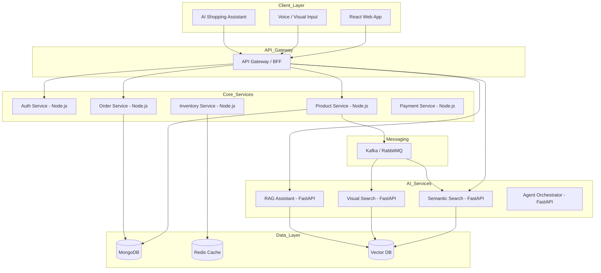

# commerce-nexus

commerce-nexus is a high-performance, multi-modal e-commerce platform combining a scalable MERN transactional core with an Agentic AI layer (FastAPI + PyTorch).

---
It enables:

-  Intent-aware product discovery
- Visual product matching
- Autonomous shopping workflows
---

---
## 🧱 Architecture


</p>

## Core Features

### 🛒 Intelligence-Driven Customer Experience

1. **Multi-Modal Discovery:**
- *Semantic Search:* Intent-aware product discovery using vector embeddings
- *Visual Search:* Image-based product matching via CLIP-style models.

2. **Agentic Shopping Assistant:** RAG-powered conversational interface for comparisons, recommendations, and policy queries
3. **Secure Authentication:** Passwordless OTP login with JWT-based session management
Cart & Checkout: Persistent cart with Stripe-powered multi-currency transactions
4. **Order Tracking:** Automated lifecycle updates (Pending → Delivered) with invoices & notifications
5. **Dynamic UI:** Mobile-first glassmorphism design with real-time inventory sync

## 🛡️ Admin Management & Intelligence
1. **Inventory Management:** Full CRUD with real-time stock updates
2. **AI Inventory Intelligence:** Auto-categorization & duplicate detection via embeddings
Order Pipeline: State-driven orchestration with transactional consistency
3. **Predictive Analytics:** Sales insights + demand forecasting
4. **Media Pipeline:** Cloudinary + AI preprocessing (tagging, optimization)

5. **Knowledge Base Management:** Dynamic RAG corpus for assistant training

## ⚡ Event-Driven AI Pipeline
Product Created → Queue → Embedding Service → Vector DB
User Query → API → Vector Search → RAG → LLM → Response

## 🧩 Engineering Highlights
- **Microservices Architecture:** Decoupled Node.js + FastAPI services
- **Event-Driven Design:** Kafka/RabbitMQ for async workflows
- **Saga Pattern:** Distributed transaction handling across services
- **Circuit Breaker:** Resilience against AI latency/failures
- **Caching Layer:** Redis for performance optimization
- **Observability:** OpenTelemetry + centralized logging (ELK)
- **CI/CD:** Automated pipelines with Docker + Kubernetes
## 🛠️ Technical Stack

| Category        | Technology                                  |
| --------------- | ------------------------------------------- |
| **Frontend**    | React, Tailwind CSS                         |
| **Backend**     | Node.js (Express)                           |
| **AI Services** | FastAPI, PyTorch, LangChain                 |
| **Databases**   | MongoDB, Redis, Vector DB (Pinecone/Milvus) |
| **Messaging**   | Kafka / RabbitMQ                            |
| **DevOps**      | Docker, Kubernetes, GitHub Actions          |

## ⚙️ Deployment
### Local Development

```bash
git clone https://github.com/yourusername/commerce-nexus.git
cd commerce-nexus
docker-compose up --build
```

## Production Checklist
 [ ] Configure Redis (caching + rate limiting)\
 [ ] Set up Kafka DLQ (failure handling)\
 [ ] Enable JWT refresh token rotation\
 [ ] Configure Vector DB namespaces\
 [ ] Add monitoring (Prometheus + Grafana)\


 ## 🏗️ Engineering Principles
- Clean separation of transactional vs intelligence systems
- Async-first design for scalability
- AI as a service layer, not tightly coupled
- Production-first mindset (observability, resilience, CI/CD)


## 👨‍💻 Author

Nazmul Alam Diptu
Software Engineer | AI Systems Enthusiast