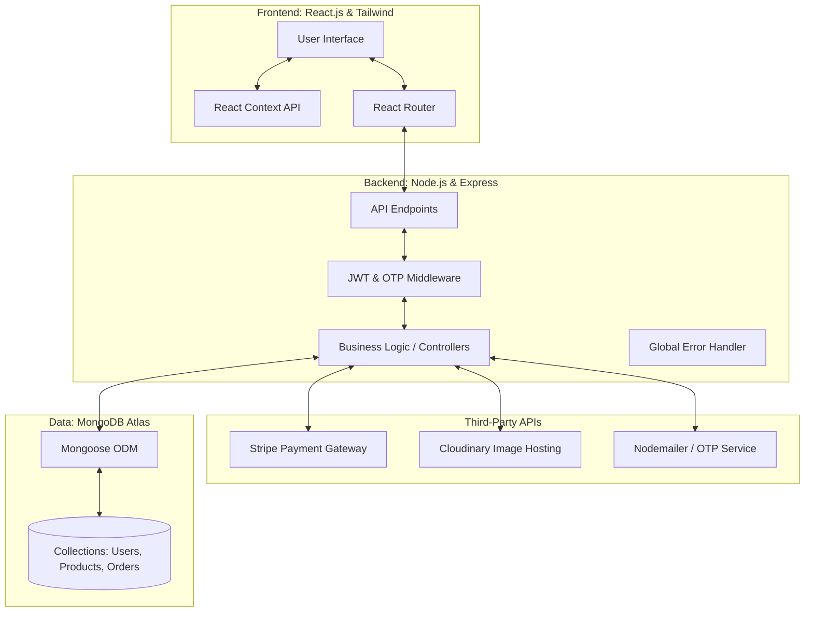

# commerce-nexus
Advanced MERN e-commerce ecosystem with real-time inventory, OTP authentication, and Payment gateway

## 🧱 Architecture

### 🎨 Frontend

### ⚙️ Backend

### 🗄️ Database

### 🔐 Auth & Security

### 💳 Payments & Media

## 🚀 Core Features

### 🛒 Customer Experience
- **Dynamic Product Discovery:** Multi-criteria filtering (Price, Category) and real-time search.
- **Secure Authentication:** Passwordless OTP-based login system for enhanced security.
- **Cart & Checkout:** Persistent cart state with integrated Stripe Payment Gateway.
- **Order Tracking:** Automated email confirmations and printable PDF invoices.
- **Responsive UI:** Dark/Light mode support with a mobile-first glassmorphism design.

### 🛡️ Admin Management
- **Inventory Control:** Full CRUD operations for products with real-time stock updates.
- **Order Management:** State-driven order pipeline (Pending → Shipped → Delivered).
- **Data Analytics:** Visualized sales data using interactive charts and metrics.
- **Media Management:** Cloud-integrated image uploads and automated optimizations.

## 🛠️ Technical Stack

| Layer | Technology |
| :--- | :--- |
| **Frontend** | React.js, Tailwind CSS, Lucide Icons, React Router |
| **Backend** | Node.js, Express.js |
| **Database** | MongoDB (Atlas), Mongoose ODM |
| **Authentication** | JSON Web Tokens (JWT), Nodemailer (OTP) |
| **Payments** | Stripe API |
| **Storage** | Cloudinary API |

## 🏗️ Architecture & Engineering
- **Modular Backend:** Separated routes, controllers, and models for high maintainability.
- **State Architecture:** Global state management using React Context to handle cart and user sessions.
- **Middleware Integration:** Custom error handling, authentication guards, and file upload processing.
- **Security:** Environment variable protection, CORS configuration, and data sanitization.

